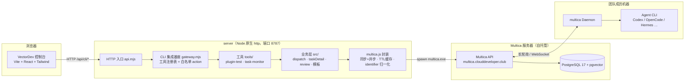

# 06 · 阶段一总结（阶段一完成）

> 更新：2026-08-16 · 范围：初始建仓 → 控制台 v1 → 任务监控 → 模板 → 公网化前
> 本文件是阶段一的完整交付总结：目标、架构、功能清单、关键决策、经验教训。

## 1. 阶段目标回顾

> 基于 Multica CLI 构建团队多 Agent 协作管理平台：
> 「一个任务同时派给多个 Agent 并行执行 → 可视进展 → 汇总 → 页面内审核」

Multica 原生模型是 **1:1 分配**（一个 Issue 一个负责人），Squad 是 leader 串行路由不并发。本阶段解决了「**多 Agent 并行 + 任务可视化 + 模板编排**」这一空白。

## 2. 系统架构（当前阶段）



**关键特性：**
- Agent **永远跑在成员自己的机器上**（Daemon），代码不经过服务器；
- 本机 server 只做「CLI 编排 + 数据聚合」，无数据库（任务即 Multica Issue）；
- 前端菜单数据来自 gateway 工具注册表，新增工具 = 加文件，前端零改动。

## 3. 已交付功能清单

| 模块 | 功能 | 状态 |
| --- | --- | --- |
| CLI 工具 | `fanout` dispatch / status / aggregate / config / doctor / agents | ✅ |
| CLI 集成基座 | 工具注册表、白名单 action、REST 统一入口、二级菜单 | ✅ |
| 工具① 插件测试 | Agent 紧凑表格（在线/离线/工作中）、搜索筛选、多选派发、执行时机（立即/暂不）、允许同名 | ✅ |
| 工具② 任务监控 | 任务过滤（全部/进行中/已完成/已归档）、DAG 进展图（起点→Agent→汇总→报告）、6s 轮询 | ✅ |
| 模板 | 总-分-总：起点 + N 并行 worker + 汇总 Agent（backlog 占位，手动启动） | ✅ |
| 审核 | 页面内 审核通过/驳回（评论留痕）、完整产出查看、Agent 抽屉实时工作 | ✅ |
| 任务管理 | 归档（全部 cancelled）、彻底删除（Multica 删除）、backlog 激活 | ✅ |
| 连接配置 | multica.config.json 三级优先级（CLI>env>文件）、config 命令 | ✅ |

## 4. 关键设计决策（踩坑记录）

| 决策 | 原因 / 教训 |
| --- | --- |
| 父 Issue + N 子 Issue 全 todo = 并行 | 绕过 Multica 1:1 限制，官方认可 |
| `identifier`（VC-xxx）而非 `key` | 真实 v0.4.13 无 key 字段；`normalizeIssue()` 统一 |
| `issue children` 必须 `--output json` | 默认表格！返回 `{stages,total,unstaged}` |
| 子任务描述注入隔离目录 + 统一文件名 | 多 Agent 并行不互相覆盖文件 |
| CLI 调用异步并行 + TTL 缓存 | presence 4.4s→1.3s、任务详情 8s→1.8s（曾误判"Multica 慢"） |
| 任务打 metadata `fanout_task=true` | 任务列表不依赖标题前缀，可靠过滤 |
| 同标题 active issue 保护 | Multica 防重复机制；提供 `--allow-duplicate` 透传 |
| backlog=暂不执行 / todo=立即执行 | 执行时机控制（用户核心诉求） |
| 页面内审核（review/approve/reject） | 用户不愿回 Multica 操作 |

## 5. 真实数据（2026-08-16 工作区）

- 服务器：`https://multica.clouddeveloper.club` · workspace「开放能力」(vector)
- 24 个 Agent（14 在线 / 10 离线，含 SSY Coding、插件开发agent、lipiexin-coding 等）
- 完整跑通：插件回归测试（总-分-总）→ 2 worker 执行 → done → 汇总节点待启动

## 6. 经验教训

1. **性能问题先诊断再下结论**：网页卡顿根因是串行 spawn，不是 Multica 慢；
2. **真实 API 与文档有差异**：`identifier`/children 结构/`--output json` 必须以真实 CLI 为准（已写入 03-架构说明 §4.2）；
3. **分配即执行**：非 backlog 的 issue 分配给 Agent 会立即入队——调试用 fake，别误触真实任务；
4. **大改动先对齐需求**：任务菜单层级、存储、dry-run 等，先与用户确认再实施（避免过度设计）。

## 7. 代码规模

```
multica-fanout/
├── bin/fanout.js      CLI 入口
├── src/               multica.js · dispatch.js · templates.js · config.js
├── server/            api.mjs · gateway.mjs · dev.mjs · tools/ ×2
├── web/               Vite+React（App Shell + 2 个工具页 + 组件库）
└── test/              fake CLI mock + 11 个测试（全绿）
```
