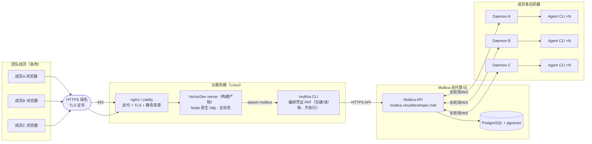

# 07 · 阶段二设计方案：网页公网化（团队共享）

> 更新：2026-08-16 · 状态：设计稿（待评审）
> 目标：把 VectorDev 控制台从「本机单用户」变为「公网部署、项目组兄弟都能用」的团队工具。

## 1. 现状与目标

### 1.1 现状（阶段一）

```
成员本机浏览器 → localhost:8787（server） → 本机 multica CLI → 远程 Multica API
                                              ↑ 本机 Daemon 执行 Agent
```
- server 和 web 都跑在开发机，只有本机能用；
- Agent 执行依赖本机 Daemon（执行在成员机器上，代码不经过服务器——这是 Multica 的架构优势，必须保留）。

### 1.2 目标（阶段二）

- 网页部署到**公网服务器**，团队成员浏览器直接访问；
- 成员各自本机跑 **Daemon**，注册到同一 Multica workspace —— 大家共享网页编排，各自贡献 Agent 算力；
- 服务器只做「编排 + 聚合 + 鉴权」，**不执行 Agent、不存业务数据**（任务仍在 Multica）；
- 安全：登录鉴权、操作审计、权限隔离。

## 2. 核心问题：谁执行 Agent？

| 方案 | 说明 | 评价 |
| --- | --- | --- |
| A. 服务器执行 | 服务器跑 Daemon + 所有 Agent CLI | ❌ 成员机器白装；服务器权限过大；Agent 算力不均衡 |
| B. 成员机器执行（推荐） | 服务器只跑 multica CLI（无 Daemon），各成员本机 Daemon 注册同 workspace | ✅ 符合 Multica 设计：执行在成员机器、代码不出内网、算力分散 |
| C. 混合 | B + 服务器可选挂 1-2 个共享 Agent（7×24） | ✅ 推荐进阶：常驻共享 Agent 兜底 |

**推荐 B（+ 可选 C）**：服务器持有「编排凭证」（能建/改 Issue），成员 Daemon 持有「执行能力」。二者天然分离，权限最小化。

## 3. 目标架构



**数据流（一次派发）**：
1. 成员 A 登录网页 → 勾选 Agent → 派发任务；
2. 服务器校验会话 → 调本机 multica CLI（PAT）→ 创建父 + N 子 Issue 到 Multica；
3. Multica 把任务**按成员注册的 Daemon 分发**：A 的 Agent 由其本机 Daemon 领取执行；
4. 网页轮询任务详情 → 成员各自实时看到进展（执行在各自机器，输出回写 Multica）。

## 4. 认证与安全设计

### 4.1 登录（分期）

| 阶段 | 方案 | 说明 |
| --- | --- | --- |
| M1（先行） | **共享访问码** | 部署时生成一个 code；前端登录页输入 → 后端校验 → 发 HttpOnly Session Cookie（随机 token，存内存/可选 Redis） |
| M2 | **按成员账号** | 服务器维护成员表（用户名+密码/邀请码），角色：admin（可派发/审核/删）/ viewer（只读） |
| M3（可选） | 对接组织 SSO / OIDC | 复用公司统一登录 |

### 4.2 权限边界

- **服务器 PAT 最小化**：Multica 侧建一个专用「控制台」账号或受限 PAT，仅授予：创建/读取/更新 Issue、读 Agent 列表。**不授予**高权限（删除、敏感配置）。
- **操作审计**：每次写操作（派发/审核/删除/归档）记录 `{谁, 何时, 动作, 目标}` 到服务器日志（未来可接审计库）。
- **禁止**：网页不暴露任意 CLI 执行；所有动作走 gateway 白名单 action（已有）。

### 4.3 传输与存储安全

- HTTPS（TLS 1.2+，证书自动续期：certbot）；
- Session Cookie：HttpOnly + Secure + SameSite；
- PAT/密钥：服务器环境变量或 .env（gitignore），不进仓库；
- 无本地业务数据库 → 数据泄露面小。

## 5. 并发与性能（公网多人）

| 问题 | 当前 | 公网化方案 |
| --- | --- | --- |
| 多人同时派发 | 单用户 | server 保持无状态 + 异步（已有 Promise.all） |
| spawn 并发 | 无限制 | **并发信号量**：同时 spawn ≤ 8，超出排队（避免打爆 CLI/服务器） |
| 滥用/刷接口 | 无 | 限流：IP/会话级（如 60 req/min），登录页单独限流防爆破 |
| 前端轮询 | 每用户 6s 全量 | 合并请求（服务端按需）；或 M2 引入 WS 推送 |
| 多实例 | 单进程 | 无状态 → 可 `node --cluster` 或多实例 + 共享会话存储 |

## 6. 部署实施步骤（M1 最小可用）

```bash
# 1. 云服务器（Ubuntu 22.04+）：装依赖
curl -fsSL https://deb.nodesource.com/setup_22.x | bash - && apt install -y nodejs nginx
curl -fsSL https://raw.githubusercontent.com/multica-ai/multica/main/scripts/install.sh | bash
multica setup self-host --server-url https://multica.clouddeveloper.club --app-url https://multica.clouddeveloper.club   # 用控制台专用账号

# 2. 构建前端 + 部署
git clone git@github.com:huaweicloud-mate/VectorDev.git
cd VectorDev/multica-fanout
npm --prefix web ci && npm --prefix web run build      # → web/dist
node server/api.mjs                                    # 或用 pm2/systemd 托管

# 3. 反代 + TLS
# nginx: 80→443 重定向，443→localhost:8787（含 WS 头）；certbot 签发证书

# 4. 配置
# multica.config.json（服务器上）：multicaBin / workspaceId / serverUrl + ACCESS_CODE
```

**托管**：推荐 `pm2`（`pm2 start server/api.mjs -i 2`）或 systemd；日志用 pm2-logrotate。

## 7. 配置清单（新增）

| 配置项 | 说明 |
| --- | --- |
| `ACCESS_CODE` | M1 共享访问码（env，不提交） |
| `SESSION_SECRET` | 会话签名密钥 |
| `MAX_CONCURRENT_SPAWN` | 并发上限（默认 8） |
| `RATE_LIMIT` | 限流阈值 |
| `PORT` | 服务端口（默认 8787） |
| `ALLOWED_ORIGINS` | 允许的前端域名（防 CSRF） |

## 8. 里程碑拆分

| 里程碑 | 内容 | 验收 |
| --- | --- | --- |
| **M1 公网基础** | 服务器部署 + HTTPS + 共享访问码登录 + 只读浏览（Agent/任务） | 团队成员浏览器可登录查看 |
| **M2 协作执行** | 派发/审核/模板可用 + 操作审计 + 成员本机 Daemon 接入文档 | 跨成员派发真实跑通 |
| **M3 完善** | 按成员角色权限、并发限流调优、WS 实时推送、监控告警 | 稳定支撑 ≥20 人使用 |

## 9. 风险与对策

| 风险 | 对策 |
| --- | --- |
| 服务器 PAT 泄露 | 最小权限 + 环境变量 + 定期轮换；不落仓库 |
| 公网滥用派发 | 登录 + 限流 + 审计；M2 起按成员权限 |
| 服务器单点故障 | 无状态可水平扩展；可选负载均衡 |
| 成员机器离线 | Daemon 离线 = 该成员 Agent 不可用，任务排队（Multica 原生）；网页提示离线 |
| 数据主权 | 执行仍在成员机器，代码不外传（保留 Multica 优势） |

## 10. 待确认问题（评审时讨论）

1. 服务器部署在**哪朵云**（华为云？）——影响域名/证书/网络；
2. 访问码 vs 成员账号：M1 先用共享码能否接受？
3. 是否需要**服务器常驻共享 Agent**（方案 C）作为兜底算力；
4. 团队成员规模（决定限流/并发参数）；
5. Multica 自托管实例是否也需迁移到公网可达（当前 `clouddeveloper.club` 已公网可达）。
